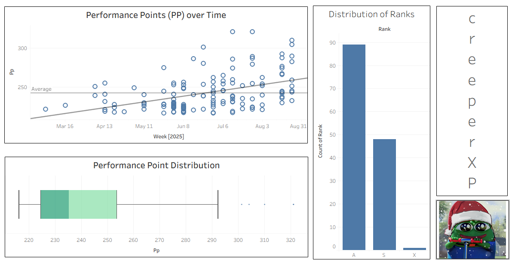

## Key Components

### Exploratory Data Analysis (EDA)
Performed EDA to understand performance points, score, and rank distributions using visualizations.

### Linear Regression Model
Used a Linear Regression model to predict future performance points based on historical data. Evaluated model performance using metrics such as RMSE.

### Tableau Visualization
Developed interactive dashboards in Tableau to visualize performance point distributions and time-series data.

